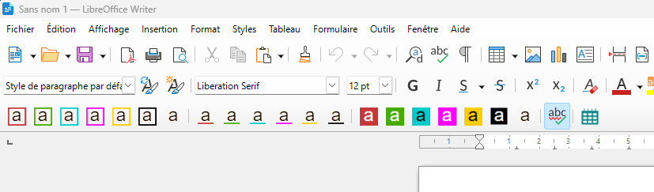

# Barre d'outils LibreOffice Writer pour Elise

Une barre d'outils LibreOffice Writer pour Elise.

## Présentation de la barre

Cette barre d'outils permet : 
- de formatter rapidement du texte
- activer/désactier la vérification orthographique
- insérer la date du jour
 
 

## Installation

Dans Writer, aller dans Outils > Entensions > Ajouter

## REX du développement

* Pour que les boutons apparaissent dans l'ordre il a fallu les nommer uniquement avecd des identifiants numériques "01", "02", .... Ajouter des lettres conduisait à des comportement non prédictibles
* Le séparateur doit utiliser 'private:separator'
* Pas d'images via images.xcu. Tout doit être déclaré dans addons.xcu.
